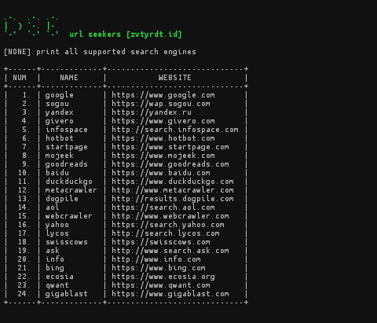

## what is this?
dseurl is a tool for retrieving urls from various search engines.<br>dseurl supports more than `20` search engines

**list of supported search engines**


or you can use the "--list" option to print on the terminal screen

## package needed
* git `apt-get install git`
* python2 `apt-get install python2`

## install 
```zsh
$ git clone https://github.com/zevtyardt/dseurl
$ cd dseurl
$ pip2 install .
```
